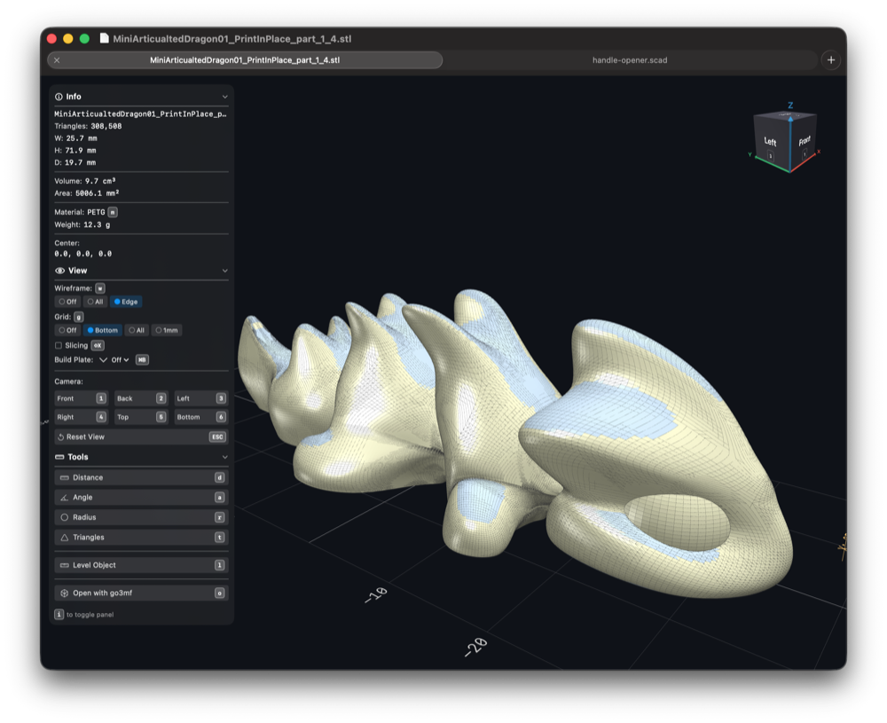
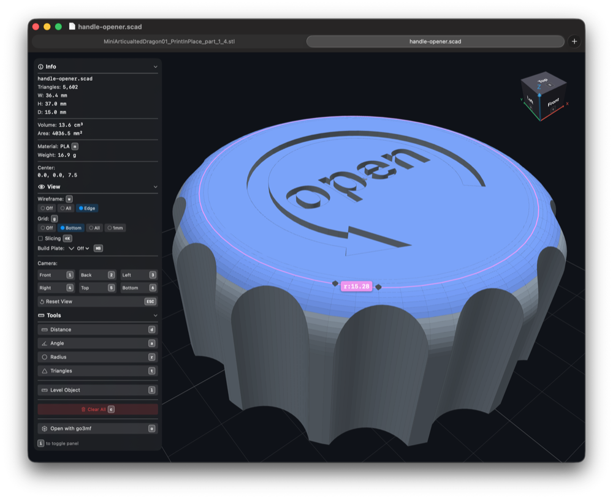
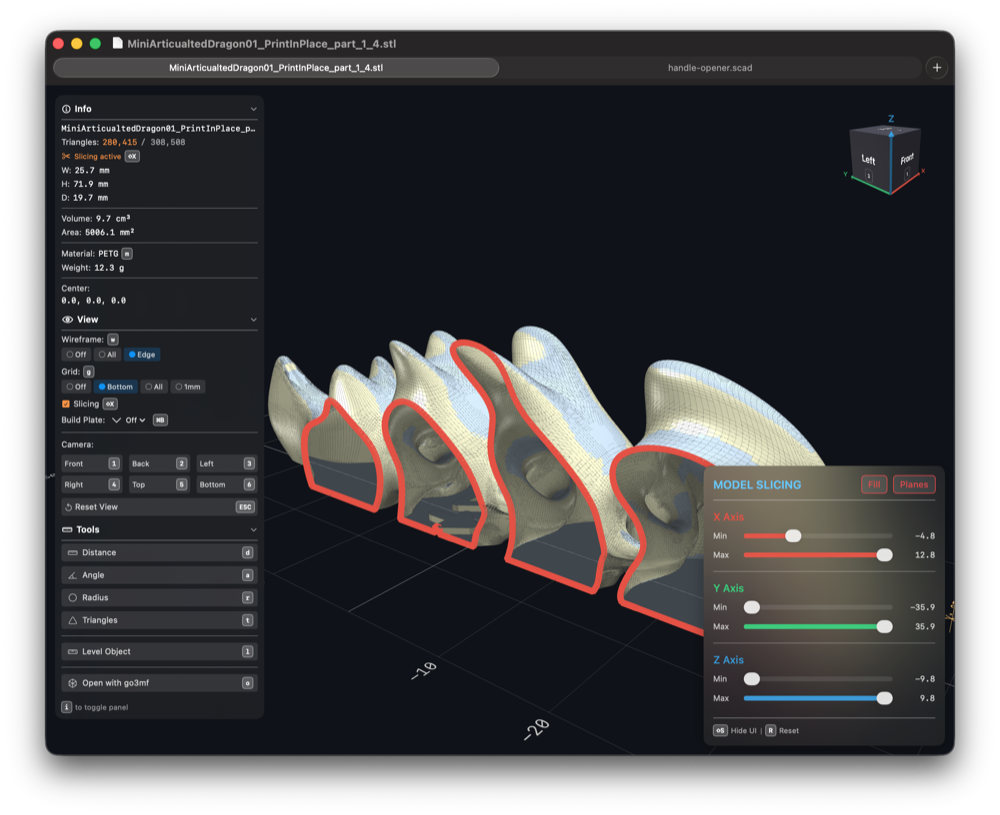

# GoSTL - GPU-Accelerated 3D Model Viewer

A native macOS application for inspecting, measuring, and visualizing 3D models with Metal GPU acceleration. Built with Swift and SwiftUI for optimal performance and native feel.

## Screenshots

| STL Rendering | OpenSCAD Rendering | Slicing |
|---------------|-------------------|---------|
|  |  |  |

## Install

```bash
brew install philipparndt/gostl/gostl
```

## Features

### File Format Support
- **STL** - Binary and ASCII stereolithography files
- **3MF** - 3D Manufacturing Format with multi-plate support
- **OpenSCAD** - Live rendering of .scad files (requires OpenSCAD)
- **go3mf YAML** - Configuration files for go3mf tool
- **Auto-reload** - Watches files for changes and hot-reloads
- **Dependency tracking** - Monitors OpenSCAD imports/includes
- **2D auto-extrusion** - Automatically extrudes 2D OpenSCAD files for visualization

### 3D Visualization
- **Metal GPU rendering** - Hardware-accelerated with 4x MSAA anti-aliasing
- **Wireframe modes** - Off, All edges, or Feature edges only
- **Face orientation coloring** - Highlights horizontal vs vertical surfaces
- **Reference grids** - Bottom, all sides, or 1mm precision grid
- **Build plate visualization** - Presets for popular 3D printers
- **Orientation cube** - Interactive navigation cube with click-to-rotate

### Measurement Tools
- **Distance measurement** - Point-to-point with live preview
- **Angle measurement** - Three-point angle calculation
- **Radius measurement** - Three-point circle/arc fitting
- **Axis constraints** - Lock measurements to X, Y, or Z axis
- **Triangle selection** - Paint or rectangle select faces
- **Export to OpenSCAD** - Copy measurements as OpenSCAD code
- **Export as polygon** - Copy selected points as polygon coordinates

### Model Slicing
- **Cross-section views** - Slice along X, Y, Z axes
- **Min/max bounds** - Dual sliders per axis for precise control
- **Cut edge highlighting** - Color-coded edges at slice boundaries
- **Real-time updates** - Smooth slider-driven slicing

### Model Analysis
- **Dimensions** - Bounding box size (W × H × D)
- **Volume calculation** - Accurate mesh volume in cm³
- **Surface area** - Total surface area in mm²
- **Weight estimation** - Based on material density and infill
- **Triangle/edge count** - Mesh statistics

### Material System
- **PLA** - Blue-gray, matte (1.24 g/cm³)
- **ABS** - Warm gray, semi-glossy (1.04 g/cm³)
- **PETG** - Blue-tinted, glossy (1.27 g/cm³)
- **TPU** - Dark gray, matte (1.21 g/cm³)
- **Nylon** - Cream/beige, semi-glossy (1.14 g/cm³)

### Model Transformation
- **Leveling** - Align two points to make them level on any axis
- **Undo support** - Revert leveling transformations

### Build Plate Presets
- **Bambu Lab** - X1C, P1S, A1, A1 mini, H2D
- **Prusa** - MK4, Mini
- **Voron** - V0, 2.4
- **Creality** - Ender 3

### Application
- **Multi-window** - Open multiple files in separate windows
- **Tabbed interface** - Multiple models per window
- **Recent files** - Quick access to recently opened files
- **Native macOS** - Keyboard shortcuts, menus, drag & drop

### External Tool Integration
- **Open in OpenSCAD** - Edit .scad files in OpenSCAD
- **Open with go3mf** - Process files with go3mf tool

## Installation

### Via Homebrew (Recommended)

```bash
brew install philipparndt/gostl/gostl
```

### From Source

Requires Xcode and Swift 5.9+.

```bash
git clone https://github.com/philipparndt/gostl.git
cd gostl
make build
```

### Optional Dependencies

- **OpenSCAD** - Required for .scad file support
- **go3mf** - Required for .yaml/.yml go3mf configuration files

## Keyboard Shortcuts

### File Operations
| Shortcut | Action |
|----------|--------|
| Cmd+T | New tab |
| Cmd+O | Open file |
| Cmd+S | Save |
| Cmd+Shift+S | Save As |
| Cmd+R | Reload |

### Camera
| Shortcut | Action |
|----------|--------|
| Cmd+1-6 | Front/Back/Left/Right/Top/Bottom |
| Cmd+0 | Reset view |
| 7 | Home/isometric view |
| F | Frame model in view |

### View Toggles
| Shortcut | Action |
|----------|--------|
| Cmd+I | Toggle info panel |
| Cmd+W | Cycle wireframe mode |
| Cmd+Shift+F | Toggle face orientation |
| Cmd+G | Cycle grid mode |
| Cmd+B | Cycle build plate |
| Cmd+Shift+X | Toggle slicing panel |

### Measurements
| Shortcut | Action |
|----------|--------|
| Cmd+D | Distance measurement |
| Cmd+A | Angle measurement |
| R | Radius measurement |
| T | Triangle selection |
| X/Y/Z | Axis constraint |
| Cmd+Shift+K | Clear all measurements |
| Cmd+Shift+C | Copy as OpenSCAD |
| Cmd+P | Copy as polygon |

### Other
| Shortcut | Action |
|----------|--------|
| Cmd+M | Cycle material |
| Cmd+L | Level object |
| O | Open with go3mf |
| Cmd+E | Open in OpenSCAD |

## Mouse Controls

- **Left drag** - Rotate camera
- **Right drag / Scroll** - Zoom
- **Middle drag** - Pan
- **Click** - Select point (in measurement mode)
- **Cmd+drag** - Paint select triangles
- **Option+Cmd+drag** - Rectangle select triangles

## Build Commands

```bash
make build      # Build debug version
make release    # Build release version
make test       # Run tests
make run FILE=./examples/cube.stl  # Run with file
```

## Contributing

Contributions are welcome! Please feel free to submit issues or pull requests.

## License

MIT License - see LICENSE file for details

## Author

Philipp Arndt (@philipparndt)
